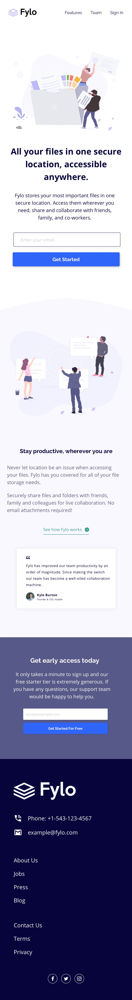

# Fylo 

**A responsive landing page prototype that follows the design guide for mobile and desktop layouts.**

Created from scratch using React and SCSS (flexbox), using no frameworks or dependencies.

You can compare the design to the real site, the designs are aimed at `375` width for mobile, and `1400` width for desktop.

# Desktop

# Mobile

